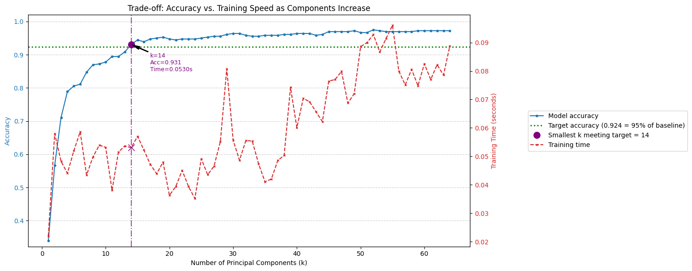

# Principal Component Analysis — PCA (concept demo)

**Skills:** Dimensionality reduction (PCA), accuracy vs. speed trade-off analysis.

Applies PCA to the scikit-learn handwritten-digits dataset (1,797 images of 8×8 pixels, so 64 features each) to measure how far the data can be compressed before a classifier's accuracy suffers.

## What's in the notebook
- Baseline classifier accuracy vs. PCA-reduced accuracy.
- Accuracy and training time for every component count from 1 to 64.
- Scree plot (variance explained per component).
- 2D projection showing how much class separation survives a 64 → 2 compression.

## How to run
Open `code/pca_analysis.ipynb` and run it top to bottom. Plots are saved to `result/`.
