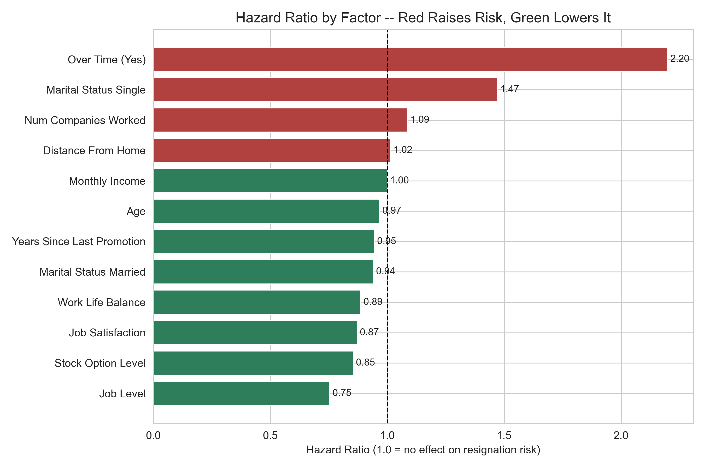

# Headcount Attrition — Survival Analysis

**Skills:** Survival analysis (Cox Proportional Hazards, Kaplan-Meier), applied statistics (log-rank test, PH-assumption check), executive reporting.

## Problem
HR wants to answer two questions with one model:
1. **Who is likely to resign next?** Rank current employees by attrition risk.
2. **Why?** Find which factors drive that risk, and by how much.

## Key results
- **Concordance index 0.85** on held-out employees: for 85% of comparable employee pairs, the model correctly predicts who leaves first.
- **Overtime is the strongest driver.** Employees working overtime resign at **2.2× the rate** of those who don't (p < 0.001).
- 10 of 12 covariates are statistically significant (p < 0.05).
- Each employee gets a relative risk score and an absolute **probability of leaving within 1 year**.



## Method
- **Cox Proportional Hazards** answers both questions at once: predicted hazard and survival curves for forecasting, hazard ratios for inference.
- Validated on a train/test split (concordance index), then refit on all employees for scoring.
- Proportional-hazards assumption checked per covariate before the hazard ratios are interpreted.
- Kaplan-Meier retention curves and a log-rank test for overtime vs. no overtime.
- 5-slide executive PowerPoint: summary, drivers, retention curves, who is at risk, recommendations.

Data: IBM HR Analytics Employee Attrition dataset (`data/IBM-HR-Employee-Attrition.csv`).

## Project structure
```
code/
  hr_attrition_analysis.ipynb  <- the analysis, step by step
  preprocessing.py             <- data loading and survival-format preparation
  cox_model.py                 <- fitting, validation, assumption checks, plots, risk ranking
  report_builder.py            <- executive PowerPoint report
result/
  figures/                     <- hazard ratios, retention curves, risk distribution
  slides/                      <- Executive_Attrition_Report_<date>.pptx
```

## How to run
```
pip install -r requirements.txt
```
Open `code/hr_attrition_analysis.ipynb` and run it top to bottom.
