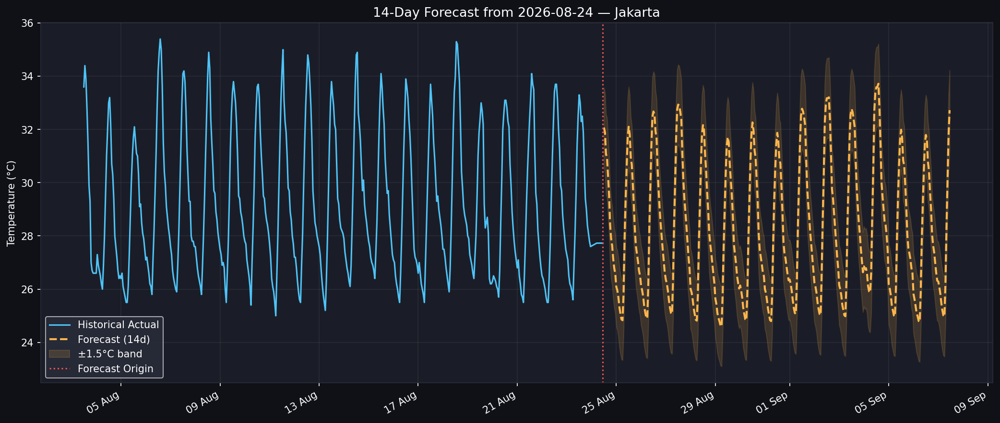

# Temperature Forecast — LightGBM Multi-Horizon

**Skills:** Time-series forecasting, LightGBM, feature engineering, walk-forward backtesting, API data pipelines.

## Problem
Forecast hourly temperature **14 days ahead** for five Indonesian cities (Jakarta, Bandung, Surabaya, Semarang, Medan), using live BMKG forecasts and Open-Meteo (ERA5) historical weather.

## Key results
Walk-forward backtest over the full 14-day horizon (~10,000 scored hours per city, `result/summary_metrics.csv`):

| City | MAE (°C) | RMSE (°C) | R² |
|---|---|---|---|
| Surabaya | 0.61 | 0.80 | 0.79 |
| Semarang | 1.02 | 1.28 | 0.82 |
| Medan | 1.48 | 1.85 | 0.54 |
| Jakarta | 1.63 | 1.89 | 0.53 |
| Bandung | 1.78 | 2.11 | 0.75 |

- Coastal Surabaya and Semarang are the most predictable. Highland Bandung has the largest absolute error, but its R² is still high because its daily temperature swing is large.
- Error grows only gradually with lead time (Jakarta MAE 1.56 °C on day 1 → 1.69 °C on day 14), with no sudden jumps. This is consistent with a model that isn't leaking future information.



## Method
- **Direct multi-horizon model:** one LightGBM model predicts every hour from T0+1h to T0+336h, with the lead time (`horizon_h`) as a feature. This avoids the error build-up of an autoregressive hour-by-hour model.
- **Leak-free features:** only information available at forecast time is used. That means origin-state features (lags, rolling statistics, momentum known at T0) plus calendar and climatology features for the target hour. Same-timestamp weather is deliberately excluded.
- **Walk-forward backtest:** many historical forecast origins, each scored against what actually happened, broken down by horizon day.
- Per-city results, plots and a saved model, plus an executive PowerPoint report.

## Project structure
```
temperature_forecast_pipeline.ipynb  <- walkthrough notebook (start here)
code/
  data_fetcher.py         <- BMKG + Open-Meteo download and caching
  preprocessing.py        <- feature engineering, horizon frame
  model.py                <- LightGBM training, backtest, plots
  main_bmkg_forecast.py   <- command-line entry point
  report_builder.py       <- executive PowerPoint report
data/<city>/raw.parquet   <- cached raw data
result/                   <- metrics, forecasts, figures, models, slides
```

## How to run
```
pip install -r requirements.txt
```
- **Notebook:** open `temperature_forecast_pipeline.ipynb` and run it top to bottom.
- **Command line:** `python code/main_bmkg_forecast.py --stations Jakarta`

Data is cached in `data/` and only re-downloaded when missing or with `--force-refresh`.
