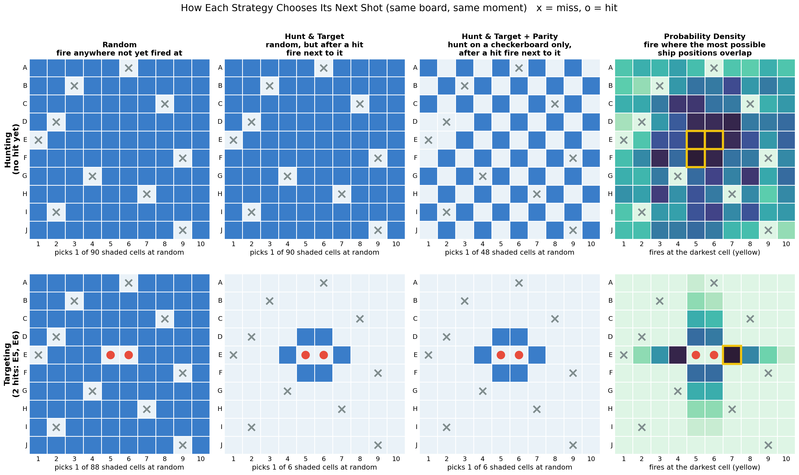

# Battleship — Monte Carlo Strategy Simulation

**Why a board game:** a public, non-confidential stand-in for simulation-based decision analysis. See the repo root README for how each Game Analysis project maps to a real skill.
**CV skill represented:** Monte Carlo simulation, Bayesian-style probability modeling, paired hypothesis testing, and adversarial (game-theoretic) thinking.

## Problem
1. **Offense:** which firing strategy sinks a full Battleship fleet in the fewest shots, and how large and reliable is the gap between strategies?
2. **Defense:** does *how* you place your ships change how long you survive, and does a "clever" placement still work once the opponent learns your habit?

## Method
- **Rules engine** (`BS_game.py`): classic 10×10 board with 5 ships (17 ship cells). When a ship sinks, its cells are revealed, which simplifies the usual "you sank my battleship" announcement.
- **Four attacker strategies** (`BS_strategies.py`), each a stateless function of what the attacker can legitimately see:

  | Level | Strategy | Idea |
  |---|---|---|
  | 1 | Random | Fire at any unfired cell (baseline) |
  | 2 | Hunt & Target | Random until a hit, then fire around open hits |
  | 3 | Hunt & Target + Parity | Hunt only on cells with (row+col) % k = 0, where k is the shortest ship still afloat |
  | 4 | Probability Density | Count every still-possible ship position, then fire at the cell most of them cover (restricted to positions through open hits in target mode) |

- **How the strategies differ, on the same board at the same moment** (shaded = cells the strategy considers for its next shot):

  

  - *Hunting (top row):* Parity skips half the board, since no ship can hide between checkerboard cells. Probability Density aims at the centre, where the most ship positions fit.
  - *Targeting (bottom row, two hits on E5–E6):* both Hunt & Target variants treat all 6 neighbouring cells as equally good. Probability Density sees that the ship most likely continues **along the same line** (E4 or E7) and fires there first.

- **Monte Carlo** (`BS_simulation.py`): 3,000 games per strategy. Game *g* uses the **same board for every strategy**, so comparisons are paired (Wilcoxon signed-rank) and board luck cancels out.
- **Defense:** four placement styles (random / edge / cluster / spread) × three attackers, 1,500 games each. The **adaptive** attacker learns the defender's habit as a prior: how often that style puts a ship on each cell compared with random placement.

## Key Findings
**Offense: each step up in strategy sophistication saves shots, and every step is statistically significant (p < 1e-140).**

| Strategy | Mean shots | Median | P90 | Won within 50 shots |
|---|---|---|---|---|
| Random | 95.2 | 97 | 100 | 0% |
| Hunt & Target | 62.5 | 62 | 81 | 21% |
| Hunt & Target + Parity | 54.6 | 55 | 65 | 31% |
| **Probability Density** | **44.8** | **44** | **57** | **75%** |

- Probability Density needs **less than half the shots of random** and beats Hunt & Target + Parity on 77% of identical boards (−9.9 shots per game).
- Parity's main gain is **consistency**: the standard deviation drops from 13.8 to 8.8 shots, removing Hunt & Target's long unlucky tail.
- These numbers line up with the classic DataGenetics (2011) Battleship analysis, which independently validates the engine.
- Ships are **3× more likely in the centre than in the corners** (22% vs 7% of boards). The analytic position count and the simulated occupancy correlate at 0.99.

**Defense: "clever" placements only work against an attacker who hasn't caught on.**

| Placement | vs Parity | vs Prob. Density (naive) | vs Prob. Density (adaptive) | Worst case |
|---|---|---|---|---|
| random | 54.7 | 44.8 | 44.8 | **44.8** |
| spread | **58.5** | 45.3 | 44.7 | **44.7** |
| cluster | 44.5 | 44.7 | 42.0 | 42.0 |
| edge | 52.9 | **51.5** | 24.7 | 24.7 |

- **Edge-hugging** is the best style against the naive probability attacker (+6.7 shots), because that attacker hunts the centre first. Once the attacker learns the habit, edge-hugging becomes a disaster: the fleet sinks in **24.7 shots**, about half the usual number.
- **Clustering** is always weak: one hit leads straight to the neighbouring ships.
- **Random and spread tie on worst case** (≈44.7 shots, within ±0.3 standard error). Spread wins clearly against the simpler Hunt & Target attacker (58.5 shots), so it is the most robust choice. This is the game-theory lesson: any predictable habit can be exploited, so the best defense is the one that gives an adaptive opponent nothing to learn.

## Deliverables (`result/figures/`)
- `example_board.png`: one random fleet placement
- `opening_probability.png`: analytic vs simulated ship-likelihood per cell
- `shots_distribution.png`, `shots_cdf.png`: shots-to-win distribution and P(won within N shots) per strategy
- `strategy_decisions.png`: how each strategy picks its next shot, side by side
- `game_snapshots.png`, `probability_density_game.gif`: the probability attacker's view, shot by shot, through one game
- `placement_styles.png`: where each placement style puts ships
- `defense_matrix.png`: attacker × placement-style matrix

Raw simulation results are in `data/` (`strategy_results.csv`, `strategy_summary.csv`, `defense_results.csv`).

## Code structure
- `code/battleship_analysis.ipynb`: Parameters cell at the top (board size, fleet, game counts, seed), then the analysis STEP by STEP.
- `code/BS_game.py`: board, fleet placement in four styles, firing rules. The `BS_` prefix marks the module as project-specific, the same convention as `SnL_` in Snake and Ladder.
- `code/BS_strategies.py`: the four attacker strategies plus the probability-map model (with an optional learned prior).
- `code/BS_simulation.py`: Monte Carlo runner, summary statistics, paired significance tests, defense matrix.
- `code/BS_visualizations.py`: all charts and the game GIF.

## How to run
```
pip install -r requirements.txt
```
Open `code/battleship_analysis.ipynb` and run it top to bottom. No external data is needed. A full run takes about 3 minutes; lower `N_GAMES` / `N_DEFENSE_GAMES` in the Parameters cell for a quicker run.

## Possible extensions
- Executive PPTX report, using the same `result/slides/` pattern as the other projects.
- A learned attacker (CNN or reinforcement learning) benchmarked against Probability Density.
- Sinking without revealing ship cells (only "you sank my X"), which makes the inference problem harder.
