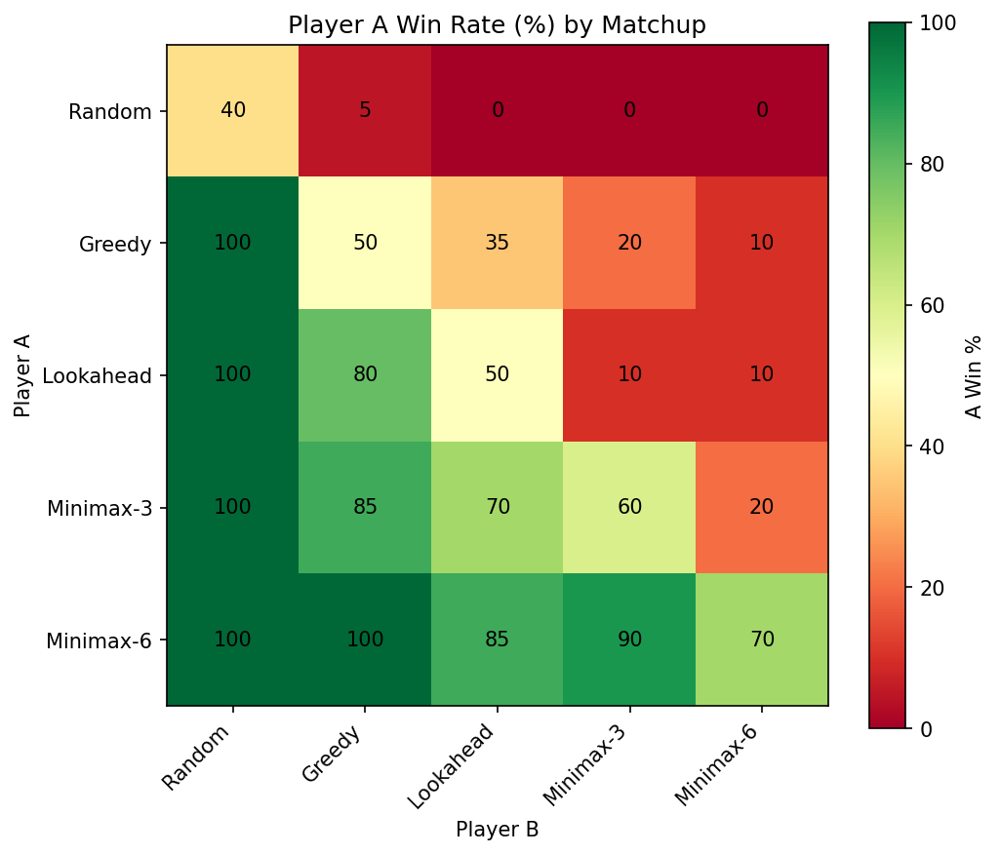

# Congklak — Minimax & Alpha-Beta Search

**Why a board game:** a public, non-confidential stand-in for algorithmic decision-making and strategy comparison.
**Skills:** Adversarial search (minimax, alpha-beta pruning), game simulation, tournament-style strategy evaluation.

## Problem
Congklak is a traditional Indonesian mancala game (7 holes and 7 seeds per side). Does searching deeper ahead actually win more games, and does the opening move matter?

## Key results
Overall win rate in a round-robin tournament (every strategy vs every strategy, both seats, 20 games per matchup):

| Strategy | Looks ahead | Overall win rate |
|---|---|---|
| **Minimax-6** | 6 moves, alpha-beta pruning | **83%** |
| Minimax-3 | 3 moves | 65% |
| Lookahead | own move + opponent's best reply | 50% |
| Greedy | own move only | 39% |
| Random | nothing | 10% |

- **Deeper search wins consistently.** Minimax-6 beats every other strategy, and each step down in depth loses more.
- **First mover advantage:** even in Minimax-6 vs Minimax-6, the player who moves first wins 70% of the 20 games.
- **Opening move:** with Minimax-6 vs Lookahead, every opening wins at least 80% of games. Starting from hole 1 is the weakest (80%), while holes 4–6 won all 15 games. The sample per opening is small, so this is a hint, not a proven rule.



## Method
- Full rules engine, including the **extra turn** (last seed lands in your own store) and **capture** (last seed lands in an empty hole on your side).
- Five strategies of increasing depth. Minimax correctly keeps the same player on an extra-turn branch instead of switching sides.
- Three experiments: round-robin tournament, opening-move study, and score progression over many games (how reliably a lead holds, not only how large it is).
- Optional: play against the computer interactively. An example game log is in `result/`.

## Project structure
```
code/congklak_analysis.ipynb  <- the full analysis, step by step
result/figures/               <- win-rate heatmap, opening-move study, score progression
```

## How to run
```
pip install -r requirements.txt
```
Open `code/congklak_analysis.ipynb` and run it top to bottom.
