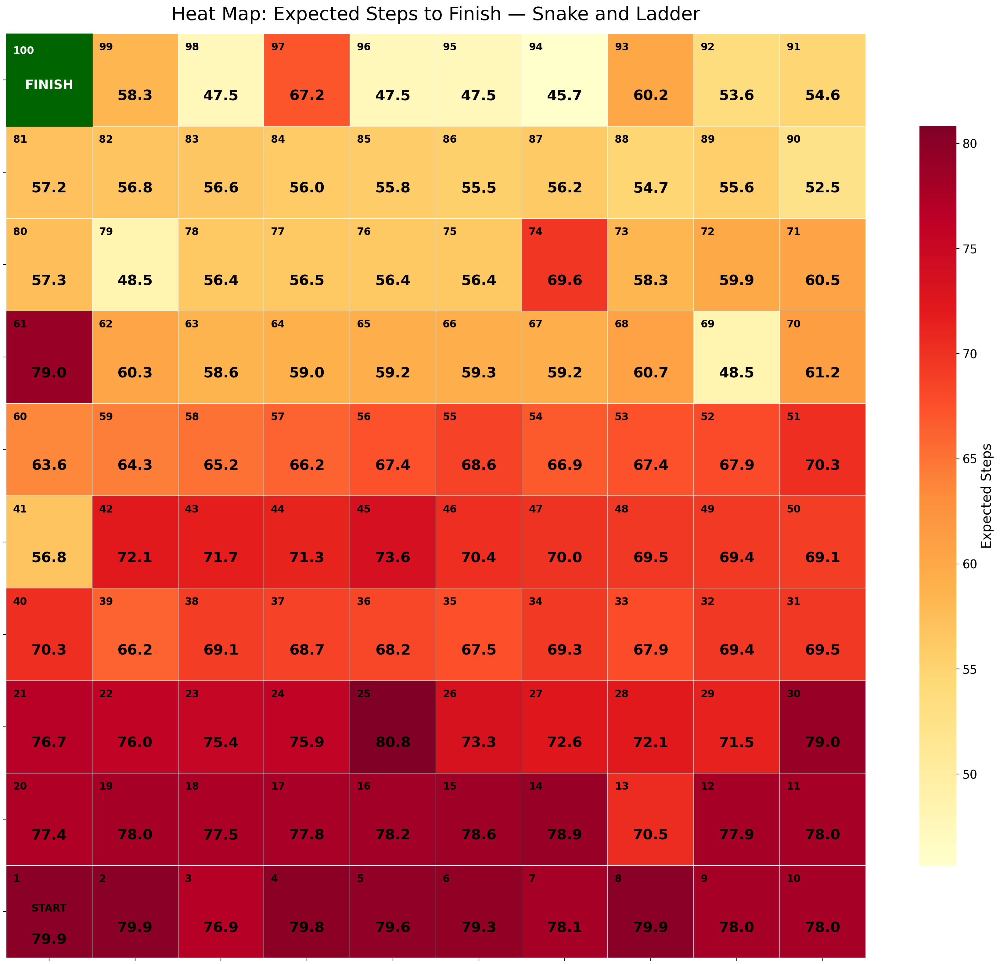

# Snake and Ladder — Markov Chain Analysis

**Why a board game:** a public, non-confidential stand-in for stochastic-process modeling.
**Skills:** Absorbing Markov chains, exact probability analysis (fundamental matrix), sensitivity analysis.

## Problem
How long does a game of Snake and Ladder really take, which snakes and ladders matter most, and does rolling more dice per turn make the game faster?

## Key results
- **A game takes 80 turns on average with one die**, but the spread is huge (standard deviation 62). The median is 62 turns, and 10% of games last more than 160 turns.
- **Snakes outweigh ladders.** Ladders save 37 turns in total, snakes add 91. The two snakes just before the finish do the most damage: **97 → 57 adds 27 turns** and **99 → 80 adds 21**.
- **More dice is not always faster.** Expected length drops from 80 turns (1 die) to **45.5 turns (3 dice, the optimum)**, then rises again to 69 turns with 7 dice. Big rolls keep overshooting square 100, and you must land on it exactly to win.



## Method
- The board is modeled as an **absorbing Markov chain** with 100 states; the finish square is the absorbing state.
- The transition matrix is built in code from the board layout and the dice-sum distribution, so the number of dice is just a parameter.
- **Exact results, no simulation:** expected turns and their variance come from the fundamental matrix N = (I − Q)⁻¹. The finish-time distribution comes from matrix powers.
- **Impact of each snake/ladder:** expected game length with vs. without that single element.
- 5-slide executive PowerPoint report.

## Project structure
```
code/
  snake_and_ladder_analysis.ipynb  <- Parameters cell (board, dice) at the top, then STEP-by-STEP analysis
  SnL_markov_chain.py              <- transition matrix and Markov-chain calculations
  SnL_visualizations.py            <- all charts
  SnL_report_builder.py            <- executive PowerPoint report
docs/                              <- reference photos of the physical board
result/
  figures/                         <- heatmap, impact ranking, distributions, dice comparison
  slides/                          <- Executive_SnakeLadder_Report_<date>.pptx
```

## How to run
```
pip install -r requirements.txt
```
Open `code/snake_and_ladder_analysis.ipynb` and run it top to bottom. No external data is needed.
