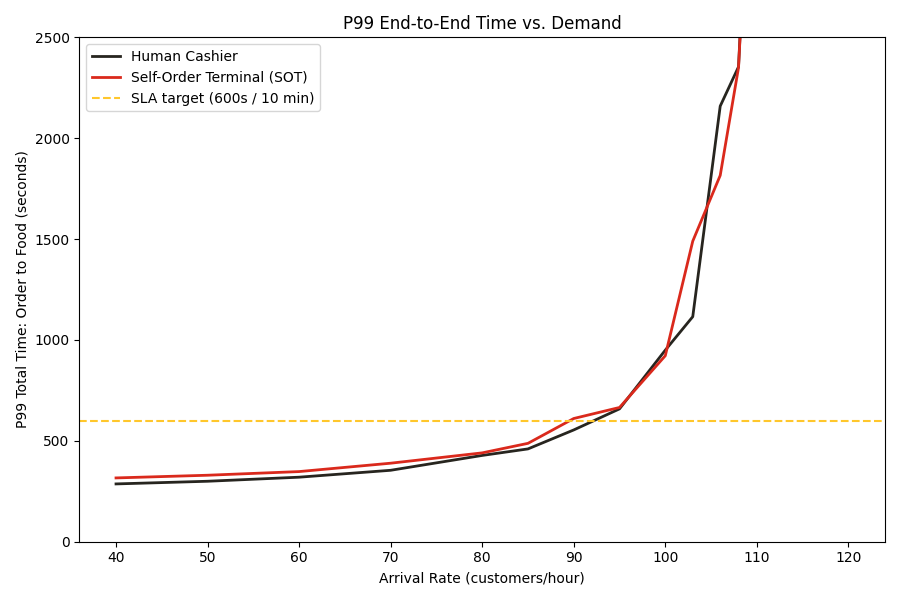

# Self-Order Terminal Staffing — End-to-End Queueing Simulation

**Skills:** Discrete-event simulation (SimPy), queueing theory, capacity planning, tail-latency (P99) SLA analysis, executive reporting.

## Problem
Should a fast-food restaurant replace its human cashiers with Self-Order Terminals (SOT)?
- A cashier takes orders **faster** per customer, but a store can usually staff only **2 cashier lanes**.
- A kiosk is **slower** per customer, but **4 kiosks** fit in the same space.
- Every order then goes to the **same kitchen**, so a faster front end may just move the queue there.

**Target:** 99% of customers get their food within **10 minutes** of joining the queue (P99 ≤ 600 s).

## Key results
- **The kitchen, not the front end, sets the capacity.** The kitchen caps at ~111 orders/hour, below both the cashiers' (132/hr) and the kiosks' (175/hr) ordering capacity. Both setups collapse at about the same demand (110–114/hr).
- **Below that point, cashiers are slightly better.** P99-safe capacity is ~92/hr for cashiers vs ~90/hr for kiosks. At 95/hr, P99 is 708 s vs 726 s.
- **On a realistic day** (lunch peak 90/hr, dinner peak 65/hr), both setups meet the SLA for every customer. Kiosks still run hotter: average 201 s vs 163 s, worst case 516 s vs 363 s.
- **Kiosk-only is the most labor-efficient setup today:** ~30 customers/hour per staff member (3 staff) vs ~18 for cashiers (5 staff).
- **Running both channels together only pays off with a bigger kitchen.** With 9 kitchen stations instead of 3, the combined front end reaches ~280 orders/hour at 25 customers/hour per staff member. Kiosk-only would stall at ~153/hr, limited by its own 4 kiosks.
- **Main takeaway:** the answer depends on kitchen speed. A real rollout decision needs a measured kitchen-throughput figure for the specific store.



## Method
- **Two-stage queue simulation (SimPy):** order-taking → shared kitchen. Each customer's order size drives the service time at **both** stages, so big orders are slow everywhere. This correlation is why a closed-form Erlang C formula can't give the P99 of the total time, and why simulation is needed.
- **Three experiments:**
  1. **Arrival-rate sweep:** at what demand does each setup break the SLA, and when does it collapse?
  2. **One realistic operating day (07:00–23:00):** lunch and dinner peaks modeled as a non-homogeneous Poisson process, with a full per-customer event log.
  3. **Both channels open at once:** customers join the shorter line; also how many kitchen stations that setup needs.
- **Assumptions** are in `data/` (service times calibrated to published QSR benchmarks; illustrative, not measured store data):

  | Resource | Servers | Service time (Gamma, CV ≈ 0.29) |
  |---|---|---|
  | Human cashier | 2 | 35 s + 7 s per item |
  | Self-order kiosk | 4 | 60 s + 8 s per item |
  | Kitchen (shared) | 3 | 55 s + 15 s per item |

## Project structure
```
code/
  order_to_food_simulation.ipynb  <- the analysis; all assumptions in one CONFIG dict at the top
  queueing_model.py               <- simulation mechanics and capacity math
  simulation_runner.py            <- sweeps, stress tests, operating day, kitchen sizing
  plotting.py                     <- all charts
  report_builder.py               <- 8-slide executive PowerPoint report
data/                             <- scenario, kitchen and order-size assumptions
result/
  figures/                        <- all charts
  *.csv                           <- sweep results, stress test, kitchen sizing, per-customer event log
  slides/                         <- Executive_SOT_Staffing_Report_<date>.pptx
```

## How to run
```
pip install -r requirements.txt
```
Open `code/order_to_food_simulation.ipynb` and run it top to bottom.
