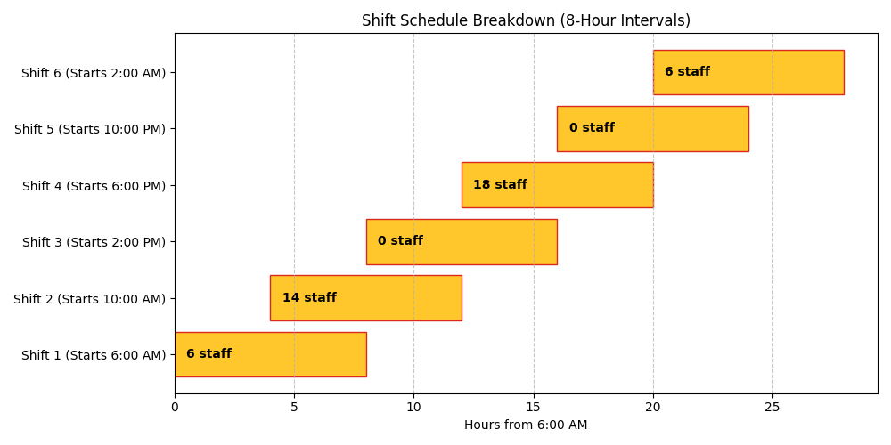

# Staffing Optimization — Linear Programming

**Skills:** Integer linear programming (PuLP), shift scheduling, workforce planning.

## Problem
A 24-hour operation is split into six 4-hour demand blocks. Each employee works one continuous 8-hour shift covering two consecutive blocks. What is the **minimum total headcount** that still meets demand in every block?

Two variants:
- `single_line_scheduling.ipynb`: one combined staff pool.
- `multi_line_scheduling.ipynb`: two separate pools (kitchen and service), each with its own demand curve.

## Key results
- **Single pool: 44 staff**, fewer than a naive estimate that staffs each block separately.
- **Two pools: 32 kitchen + 12 service.**



## Method
Integer linear program:
- **Decision variables:** number of employees starting a shift in each block.
- **Constraints:** in every block, the employees on shift (those who started in that block or the one before) must cover demand.
- **Objective:** minimize total employees.

## Project structure
```
code/
  single_line_scheduling.ipynb
  multi_line_scheduling.ipynb
data/demand.xlsx       <- demand per block
result/single_line/    <- demand vs supply chart, shift Gantt chart
result/multi_line/
```

## How to run
```
pip install -r requirements.txt
```
Open either notebook in `code/` and run it top to bottom.
