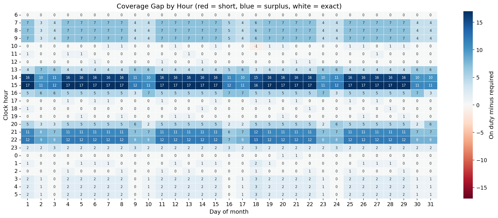

# Monthly Workforce Roster — Mixed-Integer Programming

**Skills:** Mixed-integer programming (PuLP / CBC), workforce scheduling, multi-stage decomposition, penalty-based (soft) constraints, labor-law compliance, executive reporting.

## Problem
A 24/7 restaurant needs a roster for one month (January 2027):
- which agent works which shift on which day
- how many agents the current demand really needs

The roster has to respect Indonesian working-time law and several company rules.

## Key results
- **38 agents** cover **99.97%** of the month's 3,379 required agent-hours (1 agent-hour short).
- **All 10 hard rules are met**, re-checked independently on the final roster.
- **The weekend-off rule drives the head count.** Nobody may work both Saturday and Sunday, so each weekend needs two separate crews. Without that rule, **27 agents** would be enough.
- **Fair workload:**
  - every agent works 19–20 days
  - M / E / N shifts are spread evenly across agents
  - overtime per agent stays between 1 and 14 hours a month
- Surplus staff concentrates where shifts overlap (14:00–16:00, 21:00–23:00) and in the early morning. Staggered start times are the next lever.



## Shift codes
| Shift | Time | Break options | Codes |
|---|---|---|---|
| M (Morning) | 07:00–16:00 | 10:00 / 11:00 / 12:00 | M10, M11, M12 |
| E (Evening) | 14:00–23:00 | 17:00 / 18:00 / 19:00 | E17, E18, E19 |
| N (Night) | 21:00–06:00 | 00:00 / 01:00 / 02:00 | N00, N01, N02 |

- Overtime of 1–2 hours is added **B**efore or **A**fter the shift. For example, `M10_B1` = 06:00–16:00 and `E18_A2` = 14:00–01:00.
- This gives 45 shift codes in total.
- Each decision variable carries the full decision in its name: `Agent01_20270101_M10_B1` = 1 means Agent01 works M10_B1 on 1 January 2027.

## Rules
**Hard (never broken):**
- 40-hour week: max 5 work days in any 7 days
- Overtime: max 2 h per shift and 18 h in any 7 days
- Max 5 consecutive work days; max 2 consecutive days off
- No DO–Work–DO pattern
- No overtime on two consecutive days
- No night → morning rotation
- At least 8 h rest between shifts
- A Saturday or Sunday off every weekend

The labor-law values follow UU 13/2003 as amended by UU 6/2023, and PP 35/2021.

**Soft (penalties, highest first):**
- under-demand
- overtime
- overtime balance
- shift balance
- over-demand (a tiny weight that only stabilizes the solution)

Pay is reported, not optimized.

## Method
One model deciding head count, days off and shifts for a whole month is too large for the open-source CBC solver. The work is split into three stages, each small enough to solve well:
1. **Staffing plan:** how many agents, and how many work each shift code each day. Per-agent rules are applied in aggregate. Solved in priority order: least under-demand first, then the fewest agents, then the least overtime.
2. **Day pattern:** which days each agent works, under every day rule.
3. **Shift assignment:** which code each agent works on each work day. Rest and rotation rules and hourly coverage apply. The solver starts from a valid, balanced greedy roster (warm start).

The full mathematical formulation (sets, parameters, variables, constraints, objective of every stage) is written out in the notebook.

Demand is an assumption: customers per hour (the Self-Order Terminal project's curve, extended to 24 hours) converted to agents per hour with a workload standard. A real demand forecast would replace it.

## Project structure
```
code/
  workforce_scheduling.ipynb   <- results and charts, plus the full mathematical formulation
  roster_engine.py             <- everything else: constants, demand, shift codes, the 3 stages, results, charts
  report_builder.py            <- 7-slide executive PowerPoint report
result/
  roster_january_2027.csv          <- the roster as a pivot table: agent x date, cells = shift code
  roster_shifts_january_2027.csv   <- one row per shift, with times, hours and pay
  solution_set_january_2027.csv    <- every decision variable equal to 1
  figures/                         <- demand, coverage, fairness and roster charts
  slides/                          <- Executive_Workforce_Roster_Report_<date>.pptx
```

## How to run
```
pip install -r requirements.txt
```
Open `code/workforce_scheduling.ipynb` and run it top to bottom. A full run takes about 15 minutes, because each stage runs CBC up to its time limit.
