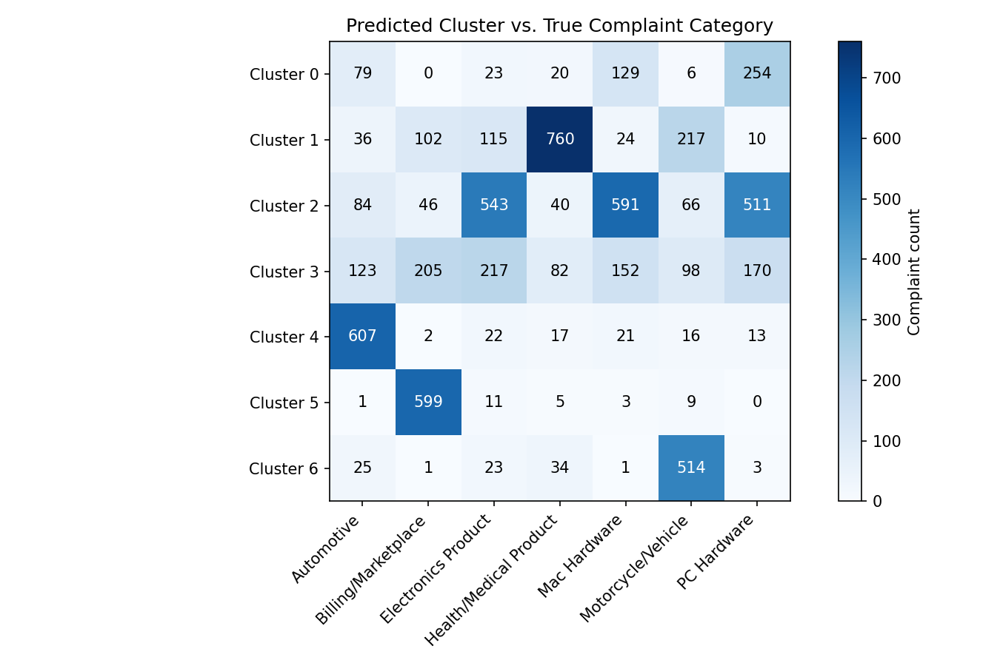

# Complaint Segmentation — K-Means Clustering

**Skills:** Unsupervised learning (K-Means, Elbow Method), NLP feature engineering (TF-IDF, LSA / Truncated SVD), cluster validation (ARI, NMI).

## Problem
A support team receives thousands of free-text complaints with no category labels. Can they be grouped automatically into topics for first-pass triage?

**Data:** real public text used as a proxy for complaint tickets. The [20 Newsgroups](https://scikit-learn.org/stable/datasets/real_world.html#the-20-newsgroups-text-dataset) dataset provides 6,630 forum posts from 7 categories, mapped to complaint-style topics (PC Hardware, Mac Hardware, Automotive, Motorcycle/Vehicle, Health/Medical Product, Electronics Product, Billing/Marketplace). The true categories are never used for fitting, only to check the result afterwards.

## Key results
- **ARI 0.29, NMI 0.39**: well above chance (0 for random grouping).
- **Five of seven topics form clean clusters.** Mac Hardware and Electronics Product blend together, which makes sense since their vocabulary overlaps heavily.
- **Verdict:** good enough to pre-sort tickets for a human, not good enough for fully automatic routing.



## Method
1. **Text → numbers** (`data/text_feature_engineering.ipynb`): strip headers, footers and quotes so metadata can't leak the category, then TF-IDF (9,387 terms) → LSA / Truncated SVD (100 dimensions, L2-normalized).
2. **Choose k** with the Elbow Method, without looking at the true labels.
3. **Fit K-Means** (k = 7), then score against the true categories (ARI, NMI) and read example texts from each cluster.

## Project structure
```
code/
  kmeans_algorithms.ipynb          <- the analysis: Elbow, fitting, evaluation
data/
  text_feature_engineering.ipynb   <- data preparation: text -> feature matrix
  complaint_features.parquet       <- output of the notebook above
  complaint_topics_subset.parquet  <- the raw text subset used
result/                            <- elbow plot, heatmap, 2D projection
```

## How to run
```
pip install -r requirements.txt
```
Open `code/kmeans_algorithms.ipynb` and run it top to bottom. The feature files are already in `data/`. To rebuild them, run `data/text_feature_engineering.ipynb` first; it downloads 20 Newsgroups through scikit-learn.
